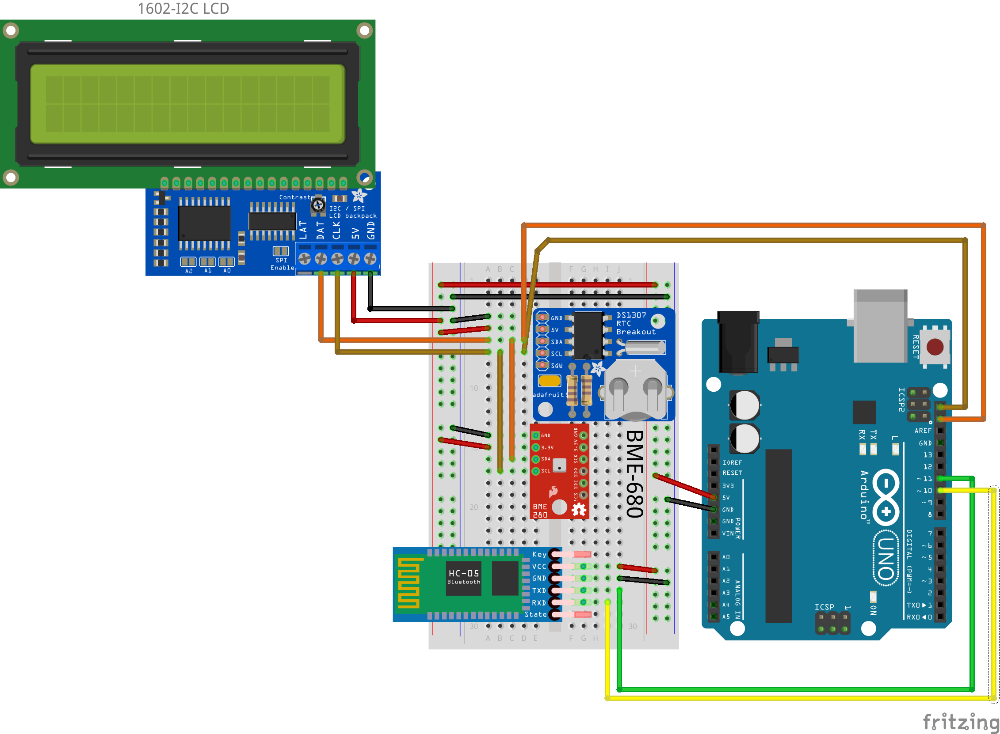

# Bluetooth Environment Monitor
_TODO: fill description_

## Parts list
- arduino board (UNO Rev3 or Micro Pro)
  - a proto shield does help but it's not mandatory
- HC-05 Bluetooth module
- BME680 Air Quality Sensor - Pimoroni Breakout Board
- 16x02 LCD - generic Hitachi like
- DS1307 RTC Module from Sparkfun
- breadboard & conenctig wires

## Connections

GND and 5V are taken from Arduino board for all modules
The LCD, RTC module and BME680 sensor use I2C so connect the I2C data lines to Arduino (SDA & SCL).

HC-05 sends data via serial communication. I use SoftwareSerial library to keep the HW Tx Rx lines free.

> When uploading on UNO Rev.3 with a connection made to the HW Tx Rx pins the code will not upload and it's necessary to remove first the BT module and upload after than reconnect.

| HC-05 | Arduino |
| ----- | ------- |
| Rx    | Pin 10  |
| Tx    | Pin 11  |

## Schematic

## Bluetooth Commands

#### 1. Get date
_TODO_
#### 2. Get environment data
_TODO_
#### 3. Set RTC time
_TODO_